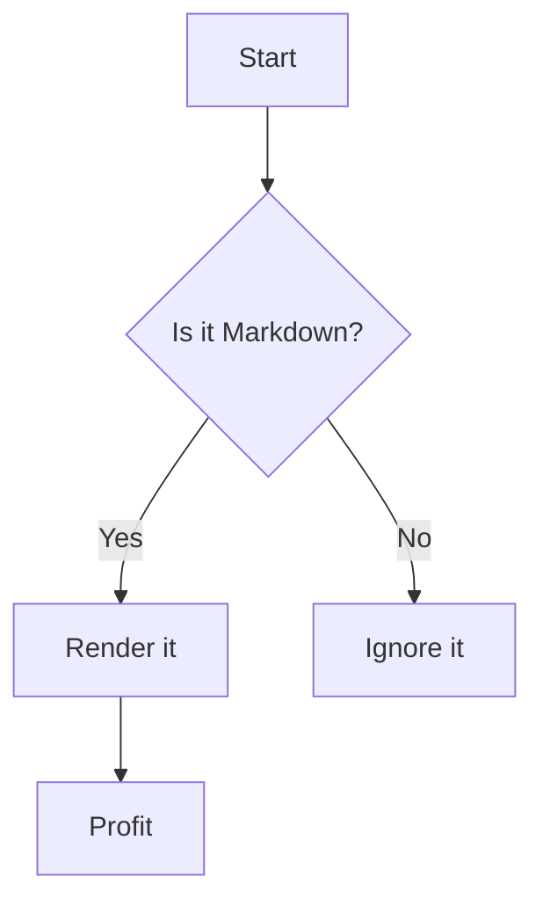
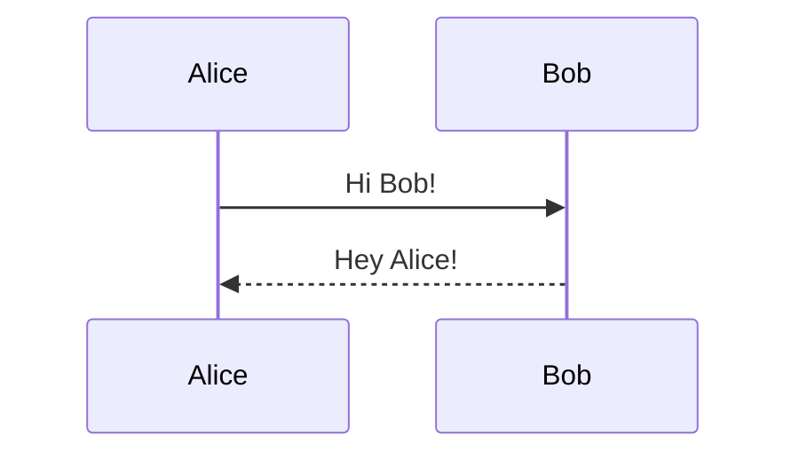

# 📚 Ultimate Markdown Showcase

A comprehensive demonstration of every kind of data and formatting supported in Markdown — raw and ready to paste into your `.md` file.

---

## 🧱 Headers

# H1

## H2

### H3

#### H4

##### H5

###### H6

---

## 🅰️ Text Styles

**Bold**

_Italic_

~~Strikethrough~~

**_Bold & Italic_**

> 💡 Blockquote
>
> > Nested blockquote

---

## 🔡 Inline Code & Code Blocks

Here is `inline code`.

<details>
<summary>JavaScript</summary>

```js
const hello = () => {
  console.log("Hello, Markdown!");
};
```

</details>

<details>
<summary>Python</summary>

```python
def greet():
    print("Hello from Python")
```

</details>

<details>
<summary>HTML</summary>

```html
<section class="highlight">
  <h2>Hello Markdown</h2>
</section>
```

</details>

---

## ✅ Task Lists

- [x] Write Markdown
- [x] Add code blocks
- [ ] Learn Mermaid
- [ ] Become Markdown god

---

## 🔗 Links

[OpenAI](https://openai.com)

---

## 🖼️ Images


---

## 🧮 Tables

| Language | Type    | Compiled |
| -------- | ------- | -------- |
| JS       | Dynamic | ❌       |
| TS       | Static  | ✅       |
| Python   | Dynamic | ❌       |

---

## 🔢 Ordered List

1. One
2. Two
3. Three
   1. Nested
   2. Nested again

---

## 🔘 Unordered List

- Bullet
- Another bullet
  - Sub bullet

---

## 🔤 Definition List

**Frontend**

> Code that runs in the browser.

**Backend**

> Code that runs on the server.

---

## 💻 GitHub-Flavored Markdown

### Commit

```bash
git commit -m "Add Markdown example"
```

### Diff

```diff
- old line
+ new line
```

---

## 🔬 Math (KaTeX / LaTeX)

Inline math: $E = mc^2$

Block math:

$$
\int_0^\infty x^2 dx = \frac{1}{3}x^3 \Big|_0^\infty
$$

---

## 🧠 Mermaid Diagrams





---

## 🧱 HTML Support

<div style="background: #111; color: #fff; padding: 1rem;">
  <strong>This is raw HTML inside Markdown</strong>
</div>

---

## 🧪 Escaping

Here is how to escape characters:

\*not italic\*  
\`not code\`  
\\ backslash

---

## 📅 Footnotes

This is a sentence with a footnote.[^1]

[^1]: This is the footnote.

---

## 🎭 Emojis & Entities

- 😎 `:sunglasses:`
- 💥 `&#128165;`
- © `&copy;`
- ♥ `&hearts;`

---

## 🧩 Code Snippets (Multilang)

```ts
type User = {
  name: string;
  age: number;
};
```

```sql
SELECT * FROM users WHERE active = true;
```

```bash
yarn install --frozen-lockfile
```

---

## 🔒 YAML Frontmatter

```yaml
---
title: "Ultimate Markdown Showcase"
author: "You"
date: "2025-07-01"
tags: ["markdown", "demo", "reference"]
---
```

---

## 🧷 Anchor Links

### Table of Contents

- [Headers](#-headers)
- [Text Styles](#️-text-styles)
- [Code Blocks](#-inline-code--code-blocks)
- [Tables](#-tables)

---

## 📦 JSON

```json
{
  "name": "markdown-demo",
  "version": "1.0.0",
  "dependencies": {
    "react": "^18.0.0"
  }
}
```

---

## 🌀 Custom Styling (via HTML)

<span style="color: limegreen; font-weight: bold;">Green and bold text</span>

---

## 🪄 Toggle Blocks (Details)

<details>
  <summary>Click to reveal</summary>

👀 You found the hidden content!

</details>

---

## 🧠 Philosophy Quote

> “He who has a why to live can bear almost any how.”  
> — _Friedrich Nietzsche_

---

## ☠️ Final Boss: Nested Markdown Inside HTML

```html
<section markdown="1">
  ### 👻 This is a Markdown header inside HTML Still works if parser allows
  HTML-in-Markdown! - Item 1 - Item 2
</section>
```

---

## 🧹 The End

Thanks for scrolling.  
Now go touch some `.md`!

---
